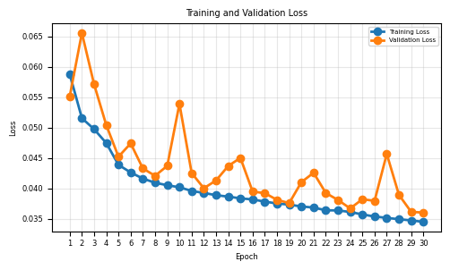
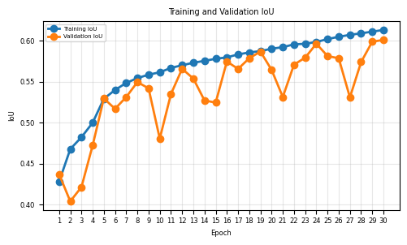
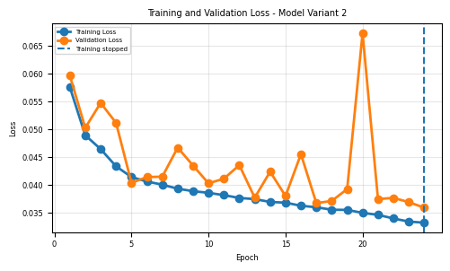
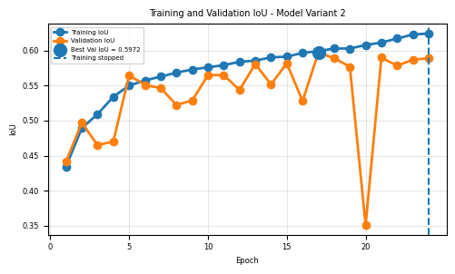

## 🧠 Abstract

Semantic segmentation assigns class labels to each pixel of an image, essential for tasks like autonomous driving, medical imaging, and robotics. While **U-Net** and similar encoder–decoder architectures perform well, they struggle with capturing fine spatial and contextual dependencies in complex scenes.

This study enhances the classic **U-Net** by integrating:
- **CBAM (Convolutional Block Attention Module)** — for better channel and spatial attention.
- **Residual blocks** — for improved gradient flow and learning stability.

Experiments on a **human clothing segmentation dataset** (59 classes, 1000 images) demonstrate consistent improvements in **loss**, **pixel accuracy**, and **IoU** compared to baseline U-Net models.

---

## Introduction

Semantic segmentation classifies each pixel into relevant classes (e.g., road, car, pedestrian). The **U-Net** architecture revolutionized this domain with its encoder–decoder structure, later influencing models like **SegNet**, **DeepLabv3+**, and **SegFormer**.

This work explores:
1. The effect of CBAM integration into U-Net.  
2. Performance evaluation and insights on architectural choices.

---

## Related Work

### 2.1 U-Net Architecture

The U-Net consists of two main components:
- **Encoder:** Extracts hierarchical features via CNN layers and pooling.
- **Decoder:** Reconstructs spatial resolution using upsampling and skip connections.

### 2.2 Residual Blocks

Introduced in **ResNet**, residual blocks use **skip connections** to ease training of deeper networks and prevent gradient vanishing.

Two main types:
- **Normal residual block**
- **Bottleneck residual block** — more efficient and effective.

### 2.3 CBAM Module

**CBAM (Convolutional Block Attention Module)** applies **channel** and **spatial attention** sequentially.

Formulas:
F′ = Mc(F) ⊗ F
F′′ = Ms(F′) ⊗ F′

yaml
Copy code

- **Channel attention:** Determines the importance of each feature channel via global pooling and MLP.  
- **Spatial attention:** Highlights relevant regions using convolution with a 7×7 filter after pooling.  

---

## Methodology

### 3.1 Dataset

##### Dataset 1 
- Dataset: **Clothing Co-Parsing** (CVPR 2014)  [link](https://www.kaggle.com/datasets/balraj98/clothing-coparsing-dataset)
- 1000 annotated images  
- 59 labels (styles, accessories, poses)

##### Dataset 2 
- Dataset: **breast-cancer-semantic-segmentation-bcss** [link](https://www.kaggle.com/datasets/whats2000/breast-cancer-semantic-segmentation-bcss/code)
- over 20000 annoted images
- 22 lables (skin, tumor, organ, etc..)

### 3.2 Model and Algorithms

**NOTE : this setup was used to conduct the experiments on Dataset 1**
- **Loss Function:** Generalized Dice Loss (GDL), effective for unbalanced data.  
- Compared with **Weighted Cross-Entropy (WCE)**.  
- **Optimizer:** Adam  
- **Learning rate:** 9×10⁻⁴  
- **Batch size:** 16  
- **Input size:** 640×360  
- **Training:** 50 epochs, early stopping with patience = 5  

** NOTE : this setup was used to conduct the experiments on Dataset 2**

- **Loss Function:** Generalized Dice Loss (GDL), effective for unbalanced data.  
- Compared with **Weighted Cross-Entropy (WCE)**.  
- **Optimizer:** Adam  
- **Learning rate:** 9×10⁻⁴  
- **Batch size:** 64
- **Input size:** 224x224 (the size of the dataset)  
- **Training:** 30 epochs, early stopping with patience = 5  

### 3.3 Experimental Design

Five U-Net variants were created:

1. Classic U-Net  
2. Residual U-Net  
3. U-Net + CBAM  
4. Residual U-Net + CBAM  
5. Dropout U-Net + CBAM  

** NOTE : for the Dataset 2 the just we conducted the classic U-net , U-net + CBAM setup** 

---
## Results
#### Dataset 1 

#### Dataset 2 
Both U-Net and U-Net + CBAM showed steady improvements during training, with decreasing loss and increasing PA and IoU. U-Net achieved a validation IoU of 60.07% after 30 epochs, while U-Net + CBAM reached a best validation IoU of 59.72% at epoch 17. Although U-Net + CBAM achieved a slightly higher training IoU (62.46% vs. 61.30%), U-Net showed more stable validation performance. Overall, U-Net performed slightly better on the available validation results, although U-Net + CBAM requires further training for a fair comparison.

 

---

## Conclusion and Future Work
#### For Dataset 1 conducted experiments 
- CBAM modules slightly improve segmentation performance.  
- The attention mechanism enhances feature focus, with stronger benefits in deeper architectures.  
- Future directions:
  - Apply CBAM to **SegNet**, **DeepLabV3+**, and **SegFormer**.  
  - Explore deeper models to further exploit attention-based feature refinement.

**Findings:**
- CBAM-augmented and residual models outperform baseline U-Net.
- Best results achieved by **Residual U-Net with CBAM**, showing improved IoU and lower loss.

#### for Dataset 2 conducted experiments 
---

## References

1. Badrinarayanan et al., *SegNet: A Deep Convolutional Encoder-Decoder Architecture for Image Segmentation*, 2016.  
3. He et al., *Deep Residual Learning for Image Recognition*, CVPR 2016.  
4. Ronneberger et al., *U-Net: Convolutional Networks for Biomedical Image Segmentation*, 2015.  
5. Sudre et al., *Generalised Dice Overlap as a Deep Learning Loss Function for Highly Unbalanced Segmentations*, 2017.  
6. Woo et al., *CBAM: Convolutional Block Attention Module*, 2018.  
8. Yang et al., *Clothing Co-Parsing by Joint Image Segmentation and Labeling*, CVPR 2014.

***(more details in the paper)***

